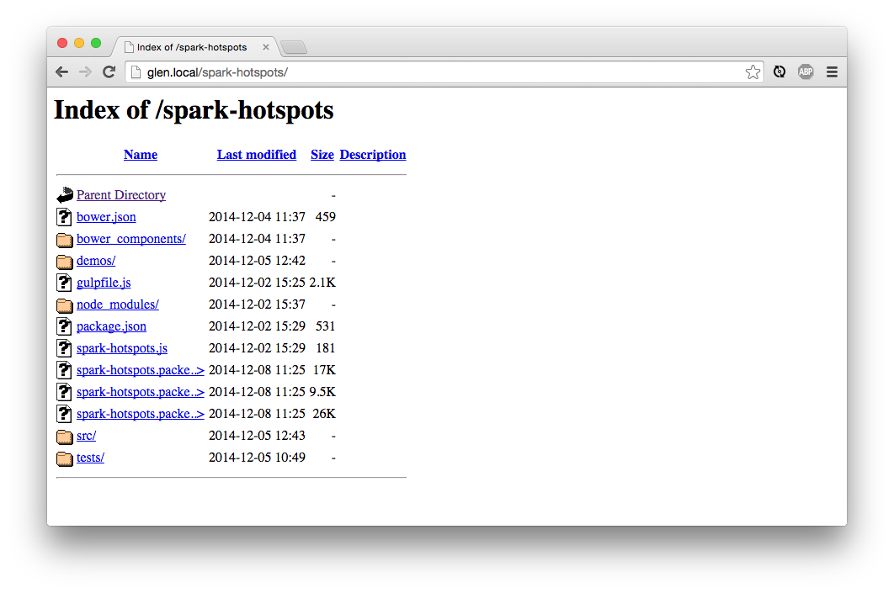
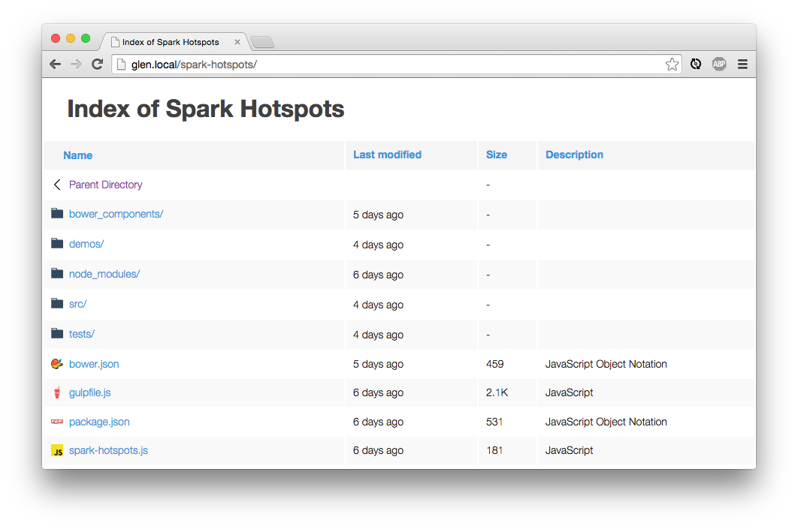
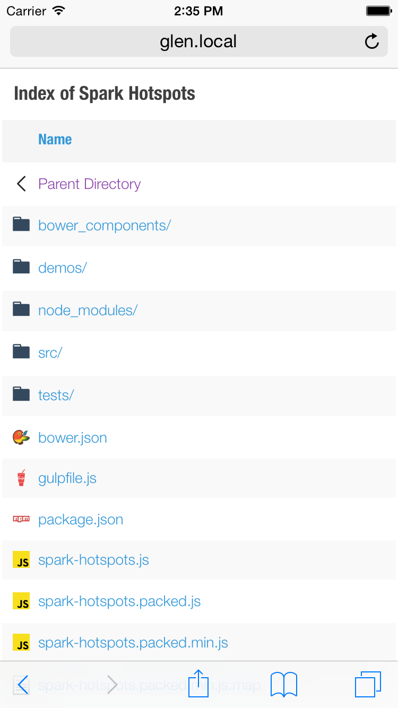

# Fancy Index

A responsive Apache index page.

I was tired of seeing the ugly apache-generated index page, so I decided to do something about it. Inspired by [Seti UI](https://github.com/jesseweed/seti-ui) and [atom file-icons](https://github.com/file-icons/atom), this project adds an `.htaccess` file which tells apache to use a table, among other things, instead of `<pre>`.

### Before Fancy Index:


### After Fancy Index



## Setup

I'm going to assume you're using a `Sites` folder with apache, but it could be done differently. Wherever you see `USERNAME`, use your username.

1. Clone or download the files.
2. Add them to your `Sites` directory. The structure should be `/Users/USERNAME/Sites/fancy-index`.
3. Copy the `.htaccess` file up one directory to `/Users/USERNAME/Sites/.htaccess`.
4. Update your `DocumentRoot` in `/etc/apache2/users/USERNAME.conf` to point to your `Sites`. This will also cause `localhost` to point to `Sites` and you won't have to use the `~USERNAME` to access it.

This is what mine looks like:
```apache
DocumentRoot "/Users/glen.cheney/Sites"

<Directory "/Users/glen.cheney/Sites">
    AllowOverride All
    Options Indexes MultiViews FollowSymLinks
    Require all granted
</Directory>

```

Now restart apache `sudo apachectl restart`.

If you're having trouble or don't see the correct files, follow one of these guides ([Yosemite](http://coolestguidesontheplanet.com/get-apache-mysql-php-phpmyadmin-working-osx-10-10-yosemite/), [El Capitan](http://coolestguidesontheplanet.com/get-apache-mysql-php-and-phpmyadmin-working-on-osx-10-11-el-capitan/), [Sierra](https://coolestguidesontheplanet.com/get-apache-mysql-php-and-phpmyadmin-working-on-macos-sierra/), [High Sierra](https://coolestguidesontheplanet.com/install-apache-mysql-php-and-phpmyadmin-on-macos-high-sierra-10-13/)) to get your Sites folder working.

## Mobile Comparison

Now you don't have to zoom in or be a sniper with your finger!

| Default  | Fancy  |
|:--------:|:------:|
|  |  |

## Customizing hidden files and directories

If you want to hide some files or directories, for example the `fancy-index` directory, there is a `IndexIgnore` directive in `.htaccess` file.

1. Edit `.htaccess` file in root directory.
2. Look for the "IGNORE THESE FILES" section.
3. Update the `IndexIgnore` directive with the path of files and directories to hide, separated by spaces.
	* For example: `IndexIgnore .ftpquota .DS_Store .git /fancy-index`
4. Save the changes.
5. Reload the index page.
